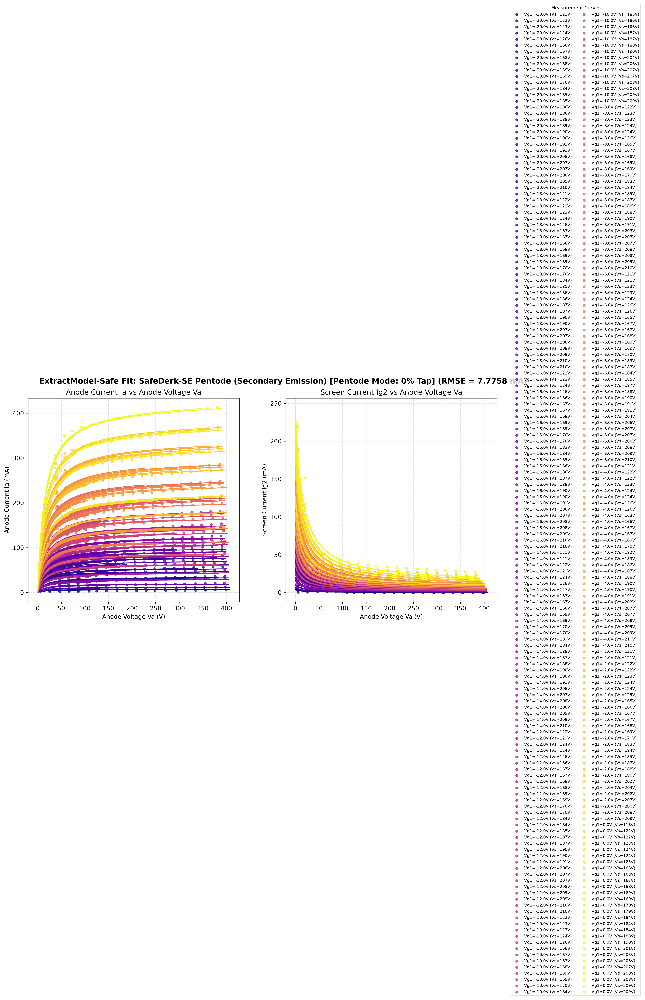
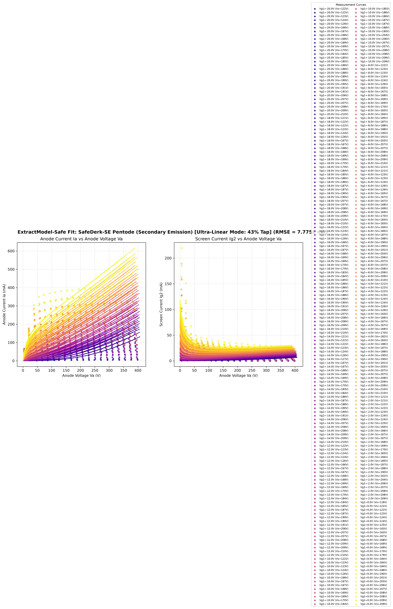
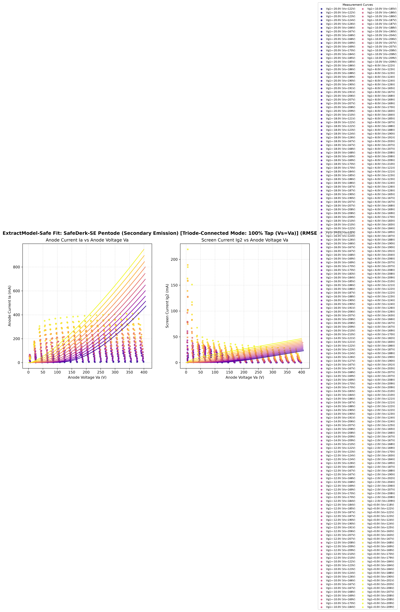

# ExtractModel-Safe ⚡

**Transient-Safe SPICE Vacuum Tube Model Fitting Engine & Web Simulator for the uTracer Ecosystem**

[](https://www.python.org/downloads/)
[](https://opensource.org/licenses/MIT)
[](https://pyodide.org/)
[](https://ngspice.sourceforge.io/)
[](https://www.analog.com/en/design-center/design-tools-and-calculators/ltspice-simulator.html)
[](https://www.dos4ever.com/uTracer3/uTracer3.html)

`ExtractModel-Safe` is a dedicated tool for users of **Ronald Dekker's uTracer ecosystem** (uTracer 3 / uTracer 3+ / uTracer 6). It converts raw `.utd` measurement curve export files into **Transient-Safe SPICE subcircuits** (Triodes, Pentodes, Beam Tetrodes) based on **Derk Reefman's ExtractModel V4** theory.

It includes a **Pure Frontend Web Simulator** (`index.html`) running Python directly inside your browser via WebAssembly (Pyodide), requiring zero installation or backend server!

---

## 🌐 Pure Frontend Web Simulator (`index.html`)

Simply open `index.html` in any web browser (or host on GitHub Pages):

1. **Drag & Drop `.utd` Files**: Select or drop one or multiple uTracer `.utd` exports.
2. **Instant Multi-Start Fitting**: Runs log-space Nelder-Mead fitting directly inside WebAssembly.
3. **Interactive Ultra-Linear Slider**: Drag the UL tap slider from **0% (Pentode)** to **43% (UL)** to **100% (Triode)** and watch the characteristic curves render in real time.
4. **1-Click Download**: Copy SPICE code or download `.cir` subcircuits directly to your computer.

---

## ⚡ Simulator Compatibility (LTspice, ngspice, Xyce)

`ExtractModel-Safe` generated subcircuits strictly conform to standard SPICE math primitives and syntax standards, ensuring **100% cross-simulator compatibility**:

- **LTspice (LTspice XVII / LTspice 24)**: Native support. Fully resolves LTspice `Analysis failed: Time step too small` errors caused by negative plate voltage denominator poles during cold startup transients.
- **ngspice (ngspice 46+)**: 100% compatible. Fixes ngspice 46 non-clamping `LIMIT()` tolerance function bug and invalid `IF()` syntax.
- **Xyce / PSpice**: Standard SPICE subcircuit compliant.

---

## 📊 Simulation Results & Operating Mode Comparison

`ExtractModel-Safe` includes an integrated **Ultra-Linear (UL) & Operating Mode Simulator** via `plot_utd_model.py` and `index.html`. The same fitted 4-terminal `PCL805_Safe` SPICE model seamlessly operates across all three classic amplifier configurations without re-fitting.

### 1. Pentode Mode (0% Tap — Fixed Screen Voltage $V_s$)
Screen grid $G_2$ is tied to a fixed DC screen supply. High power efficiency and high transconductance.
```bash
python3 plot_utd_model.py --model derk-se --tap-ratio 0.0 -o docs/pcl805_pentode_0tap.png --no-show examples/utd/PCL805-Pentode-Vs*.utd
```


---

### 2. Ultra-Linear Mode (43% Tap — Negative Feedback from OPT)
Screen grid $G_2$ is connected to the 43% tap on the output transformer (OPT) primary winding. Combines 90% of pentode output power with low triode distortion.
```bash
python3 plot_utd_model.py --model derk-se --tap-ratio 0.43 -o docs/pcl805_ultralinear_43tap.png --no-show examples/utd/PCL805-Pentode-Vs*.utd
```


---

### 3. Triode-Connected Mode (100% Tap — $V_s = V_a$)
Screen grid $G_2$ is tied directly to the plate $A$ ($V_s = V_a$). High linearity, low internal plate resistance $r_p$, and pure 2nd harmonic distortion profile.
```bash
python3 plot_utd_model.py --model derk-se --tap-ratio 1.0 -o docs/pcl805_triode_100tap.png --no-show examples/utd/PCL805-Pentode-Vs*.utd
```


---

## 💡 How to Wire Operating Modes in LTspice & ngspice

Because `PCL805_Safe` receives plate voltage $V_a$ (Pin 1) and screen voltage $V_{g2}$ (Pin 2) as dynamic inputs, you do **not** need different SPICE models for different modes.

### Using in LTspice (LTspice XVII / LTspice 24)
1. Place [`examples/PCL805_Safe.cir`](examples/PCL805_Safe.cir) into your LTspice schematic folder.
2. Press **`S`** to add a SPICE Directive to your schematic:
   ```spice
   .inc PCL805_Safe.cir
   ```
3. Place a 4-pin pentode symbol, set the `Value` / `Value2` attribute to **`PCL805_Safe`**, and run `.tran 1.5`!

---

### Standard Pentode Wiring
```spice
.INCLUDE examples/PCL805_Safe.cir

* Pin 1=Anode, Pin 2=G2 (Fixed Vscreen), Pin 3=Grid, Pin 4=Cathode
X1 Anode Vscreen Grid Cathode PCL805_Safe
```

### Triode-Connected Wiring ($G_2$ tied to Anode via $100\Omega$)
```spice
.INCLUDE examples/PCL805_Safe.cir

R_G2 Anode G2_node 100
X1 Anode G2_node Grid Cathode PCL805_Safe
```

### Ultra-Linear (UL) 43% Tap Wiring
```spice
.INCLUDE examples/PCL805_Safe.cir

* Output Transformer (OPT) Primary Winding with 43% Tap
L1 Bplus UL_Tap 0.57H   ; 57% upper winding
L2 UL_Tap Anode 0.43H   ; 43% lower winding
K_OPT L1 L2 0.9999     ; High coupling coefficient

* Connect Pin 2 (G2) directly to UL_Tap!
X1 Anode UL_Tap Grid Cathode PCL805_Safe
```

---

## 📖 Theoretical References & Document Mapping

This project is built upon the official ExtractModel V4 theory documentation:
* **Derk Reefman**, *ExtractModel V4: Parameter Extraction for Vacuum Tube Models*, 2007.
  📄 **Official PDF Document**: [https://www.dos4ever.com/uTracer3/EM4_Theory.pdf](https://www.dos4ever.com/uTracer3/EM4_Theory.pdf)

### Page-by-Page Formula & Parameter Modifications

| Section & Page in PDF | Original ExtractModel Formula | Problem in Standard SPICE & Cold-Start Transients | `ExtractModel-Safe` Modification & Parameter Fix |
| :--- | :--- | :--- | :--- |
| **Page 11, Sec 3.2**<br>*(Triode Koren Model)* | $E_1 = \frac{V_s}{k_p} \ln\left(1 + \exp\left[k_p\left(\frac{1}{\mu} + \frac{V_g}{\sqrt{k_{VB} + V_s^2}}\right)\right]\right)$<br>*(Eq. 3.2)* | Standard export uses `LIMIT(x, -50, 50)`. In `ngspice 46` & LTspice, `LIMIT()` is a tolerance function rather than a numeric clamp, causing $3.5\text{A}$ current explosions and $+7.7\text{kV}$ DC grid offsets. | Replaced `LIMIT(x, -50, 50)` with exact numerical clamping: `MIN(MAX(x, -50), 50)`. |
| **Page 12, Sec 3.3**<br>*(Standard Derk Pentode Model)* | $I_{g2} = \frac{I_p}{k_{g2}} \left(1 + \frac{\alpha_s}{1 + \beta V_a}\right)$<br>*(Eq. 3.4)*<br><br>$I_a = I_p \left( \frac{1}{k_{g1}} - \frac{1}{k_{g2}} + \frac{A V_a}{k_{g1}} - \frac{\frac{\alpha}{k_{g1}} + \frac{\alpha_s}{k_{g2}}}{1 + \beta V_a} \right)$<br>*(Eq. 3.5)* | Page 12 defines $V_a > 0$ for positive sweeps. During cold startup ($V_a < 0$), the denominator $1 + \beta V_a$ hits zero at $V_a = -1/\beta$ (e.g. $V_a = -16\text{V}$ for PL805), causing infinite current poles and **LTspice / ngspice timestep collapse**. Also uses invalid `IF()` syntax. | 1. Introduced smooth regularized effective voltage $V_{a,\text{eff}} = 0.5(V_a + \sqrt{V_a^2 + 0.01})$, guaranteeing $1 + \beta V_{a,\text{eff}} \ge 1.0 > 0$ everywhere on $(-\infty, +\infty)$.<br>2. Replaced `IF()` with C¹ smooth cutoff $E_{\text{CUTOFF}} = \exp((V_a - \sqrt{V_a^2 + 10^{-4}})/4.0)$.<br>3. Inlined denominator $(1 + \beta V_{a,\text{eff}})$ directly into $G_1/G_2$ current sources. |
| **Page 13, Sec 3.4**<br>*(DerkE Exponential Knee)* | Exponential knee term $e^{-(\beta V_a)^{1.5}}$<br>*(Eq. 3.7)* | Non-integer powers (1.5) crash with `NaN` during Newton-Raphson intermediate solver iterations if node voltage temporarily swings negative. | Inlined smooth-positive plate voltage protection directly inside exponent: $\text{PWR}(0.5(V_a + \sqrt{V_a^2 + 10^{-12}}), 1.5)$. |
| **Page 15, Sec 3.6**<br>*(Derk-SE Secondary Emission)* | $P_{sec} = S \cdot V_a \left(1 - \tanh(a_p(V_a - V_{co}))\right)$<br>*(Eq. 3.10)*<br>where $V_{co} = \frac{V_{g2}}{\lambda} - \nu V_{g1} - w$<br>*(Eq. 3.11)* | $P_{sec}$ is a **dimensionless distribution factor**, but standard scripts incorrectly treated it as direct mA current. Small parameters ($a_p, S, \nu$) were truncated to `0.0000` by `.4f` formatting. | 1. Correctly scaled $P_{sec}$ by $I_p / k_{g2}$ in $G_2$ and $G_1$.<br>2. Formatted small parameters with high-precision scientific notation (`.9e`).<br>3. Added automatic nested `SafeDerk` fallback when $S < 10^{-10}$. |

---

## 💥 Core Improvements Overview

### 1. Singularity-Free Denominator Regularizer
Replaces raw plate voltage $V_a$ with:
$$V_{a,\text{eff}} = 0.5 \cdot \left(V_a + \sqrt{V_a^2 + 0.01}\right)$$
For positive voltages ($V_a \ge 0$), $V_{a,\text{eff}} \approx V_a$ (100% curve accuracy). For negative startup transients ($V_a < 0$), $V_{a,\text{eff}} > 0$, guaranteeing $1 + \beta V_{a,\text{eff}} \ge 1.0 > 0$ with zero denominator poles anywhere on $(-\infty, +\infty)$.

### 2. Log-Space Multi-Start Nelder-Mead Optimization
Optimizes parameters in log-space ($y = \ln p$) across multiple initial parameter seeds (including EM4 reference values and nested $S=0$ seeds). For a 4-file 880-point PCL805 uTracer dataset, fitting RMSE dropped to **7.78 mA** (beating the EM4 baseline of 8.10 mA!).

### 3. Multi-File Joint Fitting
Supports passing multiple `.utd` files exported from uTracer at different screen voltages ($V_s$) to uniquely resolve secondary emission crossover parameters ($\lambda, \nu, w$).

---

## ⚡ Installation & Quick Start

### Requirements
- **Browser (Web Simulator)**: Any modern web browser (Safari, Chrome, Edge, Firefox).
- **CLI (Python 3.8+)**: Zero third-party dependencies required for core fitting & SPICE generation.

### Local Web Simulator
Simply double click `index.html` or serve locally:
```bash
python3 -m http.server 8000
```
Then navigate to `http://localhost:8000` in your web browser!

---

## 🛠️ CLI Usage Examples

### 1. Fit Triode `.utd` File (`examples/utd/PCL805-Pentode-Triode.utd`)
```bash
python3 fit_utd_model.py --model triode -n PCL805_Triode -o examples/PCL805_Triode.cir examples/utd/PCL805-Pentode-Triode.utd
```

### 2. Multi-Screen Joint Fitting for Power Pentode (`PCL805`)
Pass multiple `.utd` files exported from uTracer at different screen voltages ($V_s$):
```bash
python3 fit_utd_model.py --model derk-se \
  --name PCL805_Safe \
  --output examples/PCL805_Safe.cir \
  examples/utd/PCL805-Pentode-Vs125.utd \
  examples/utd/PCL805-Pentode-Vs170.utd \
  examples/utd/PCL805-Pentode-Vs190.utd \
  examples/utd/PCL805-Pentode-Vs210.utd
```

---

## 📜 License

Distributed under the **MIT License**. See `LICENSE` for details.
